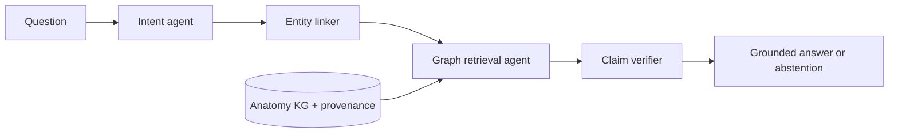

# NeuroAtlasAgent

NeuroAtlasAgent is a research-oriented prototype for **evidence-grounded neurosurgical anatomy question answering**. It combines a small anatomy knowledge graph with an agent pipeline so that every anatomical claim can be traced to graph paths and source identifiers.

> Research software only. It is not a clinical decision-support system and must not be used for diagnosis, operative planning, or patient care.

## Research question

Can graph-constrained agentic reasoning reduce anatomical hallucinations while preserving answer usefulness compared with direct LLM prompting and retrieval-only baselines?

The first benchmark focuses on the retrosigmoid corridor. The architecture is deliberately domain-independent so later datasets can cover pterional, interhemispheric, endonasal, and ventricular approaches.

## What is included

- a typed anatomy schema with provenance on every relation;
- a JSON-backed knowledge graph and bounded path search;
- intent, entity-linking, graph-retrieval, verification, and response agents;
- abstention when the graph cannot support a claim;
- a FastAPI endpoint and command-line demo;
- a reproducible benchmark with component ablations;
- a publication roadmap modeled on KARMA, AGENTiGraph, and GraphAgents.

## Quick start

```powershell
python -m venv .venv
.venv\Scripts\Activate.ps1
pip install -e ".[dev]"
neuroatlas ask "Which structures are at risk near the facial-vestibulocochlear nerve complex?"
pytest
```

Run the API:

```powershell
pip install -e ".[api]"
uvicorn neuroatlas.api:app --reload
```

Then POST `{"question":"What does the retrosigmoid approach expose?"}` to `/ask`.

## Architecture



The current response generator is deterministic by design: it makes the grounding contract testable before an LLM is introduced. A later LLM adapter may verbalize only verified graph claims.

## Evaluation plan

The primary comparison is:

1. direct LLM;
2. text retrieval + LLM;
3. KG retrieval without specialized agents;
4. full NeuroAtlasAgent;
5. ablations without verification, provenance, or multi-hop traversal.

Primary outcomes are expert-rated relation correctness, unsupported-claim rate, answer completeness, evidence precision/recall, and abstention calibration. See [docs/research_protocol.md](docs/research_protocol.md) and [docs/paper_outline.md](docs/paper_outline.md).

## Repository layout

```text
src/neuroatlas/       core graph and agents
data/                 seed graph and benchmark questions
tests/                unit and end-to-end tests
docs/                 research protocol and paper plan
scripts/              evaluation entry points
```

## Data policy

The bundled graph is a tiny synthetic seed used to exercise the software, not an authoritative anatomical atlas. Publication experiments require double-curated relations from citable atlases/papers, explicit licensing, inter-rater agreement, and a held-out expert benchmark.

## References inspiring the system design

- Lu et al., *KARMA: Leveraging Multi-Agent LLMs for Automated Knowledge Graph Enrichment*, NeurIPS 2025.
- Zhao et al., *AGENTiGraph: A Multi-Agent Knowledge Graph Framework for Interactive, Domain-Specific LLM Chatbots*, CIKM 2025 Demo.
- Stewart et al., *GraphAgents: Knowledge Graph-Guided Agentic AI for Cross-Domain Materials Design*, arXiv 2026.

